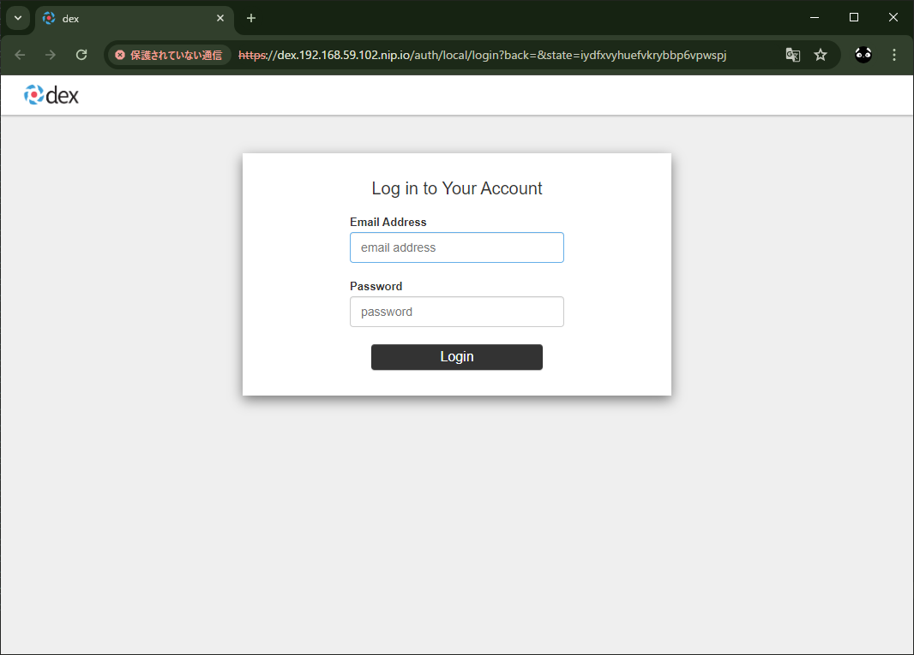
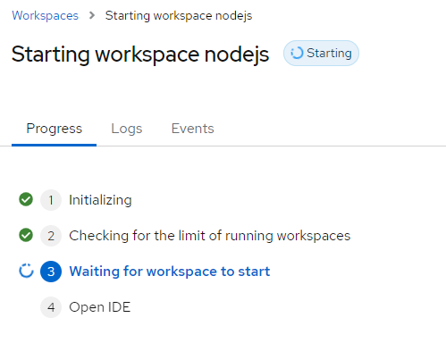
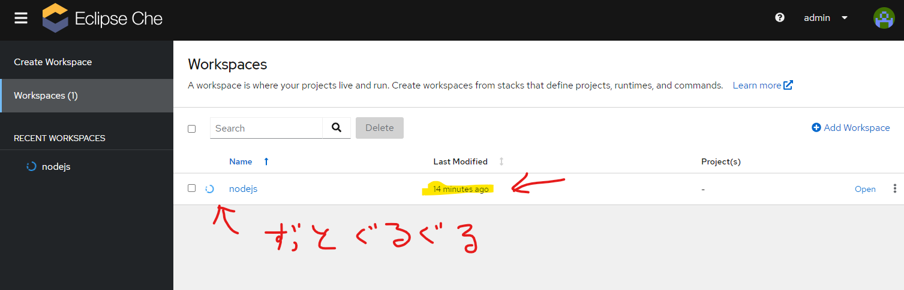
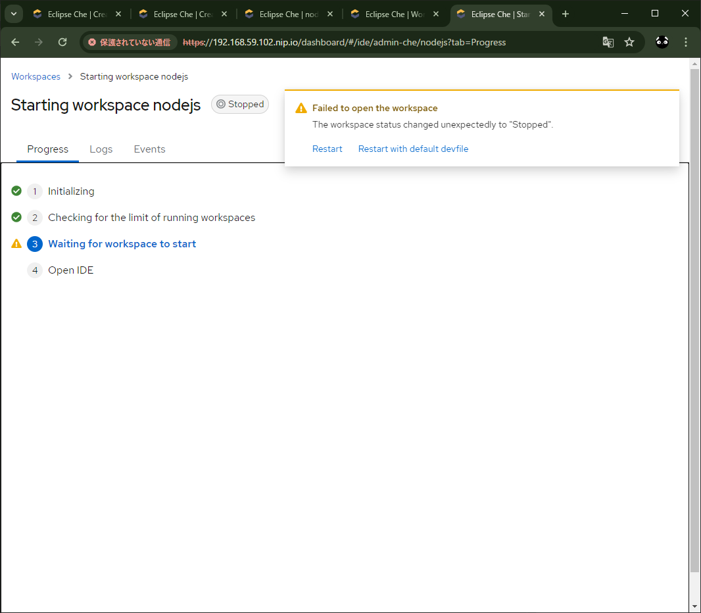
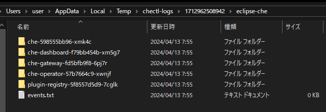

# minikube_virtualbox_eclipse_che

## 概要

* Minikube + VirtualBox 環境に [Eclipse Che](https://eclipse.dev/che/) を導入してみる
* 前回の minikube の環境構築は [minikube_virtualbox](https://github.com/Tobotobo/minikube_virtualbox) 参照

## 結果
動かず。  
仮に一時的に動いても、例えば会社や学校で広く使ってもらおうと思った時に、自分の技術不足を含め自力ではリカバリーできなさそう...

* ダッシュボードまでは行けたが、ワークスペースの作成がグルグルしたまま完了せず。
* 画面上のログやイベントからはトラブルシューティングできるほどの情報を見つけられず。
* コマンドでログを出力してみたが、何か色々エラーになってたが解決できる気がしない。

## 詳細

[Installing Che on Minikube](https://eclipse.dev/che/docs/stable/administration-guide/installing-che-on-minikube/)

[Installing the chectl management tool](https://eclipse.dev/che/docs/stable/administration-guide/installing-the-chectl-management-tool/)

[Installing the chectl management tool on Windows](https://eclipse.dev/che/docs/stable/administration-guide/installing-the-chectl-management-tool/#installing-the-chectl-management-tool-on-windows)

```
> Set-ExecutionPolicy Bypass -Scope Process -Force; iex ((New-Object System.Net.WebClient).DownloadString('https://www.eclipse.org/che/chectl/win/'))
Downloading https://github.com/che-incubator/chectl/releases/download/20240405062441/chectl-win32-x64.tar.gz to C:\Users\user\AppData\Local\Temp\chectl\chectl-tmp.tgz
Extracting chectl to C:\ProgramData\chectl...
 Command        Summary
 ────────────── ────────────────────────────────────────────── 
 autocomplete   display autocomplete installation instructions 
 cacert:export  Retrieves Eclipse Che self-signed certificate  
 commands       list all the commands
 dashboard:open Open Eclipse Che dashboard
 help           Display help for chectl.
 server:debug   Enable local debug of Eclipse Che server       
 server:delete  delete any Eclipse Che related resource        
 server:deploy  Deploy Eclipse Che server
 server:logs    Collect Eclipse Che logs
 server:start   Start Eclipse Che server
 server:status  Status Eclipse Che server
 server:stop    stop Eclipse Che server
 server:update  Update Eclipse Che server.
 update         update the chectl CLI
 version
chectl has been successfully installed
```

```
> chectl --version
chectl/0.0.20240405-next.9093dab win32-x64 node-v18.18.0
```

Start Minikube with required add-ons and sufficient resources:  
※memory と disk-size をちょっと減らした...
```
minikube start --addons=ingress,dashboard --vm=true --memory=8192 --cpus=4 --disk-size=20GB --kubernetes-version=v1.23.9
```
```
> minikube start --addons=ingress,dashboard --vm=true --memory=8192 --cpus=4 --disk-size=20GB --kubernetes-version=v1.23.9
😄  Microsoft Windows 10 Pro 10.0.19045.4170 Build 19045.4170 上の minikube v1.32.0
✨  ユーザーの設定に基づいて virtualbox ドライバーを使用します
👍  minikube クラスター中のコントロールプレーンの minikube ノードを起動しています
💾  ロード済み Kubernetes v1.23.9 をダウンロードしています...
    > preloaded-images-k8s-v18-v1...:  400.36 MiB / 400.36 MiB  100.00% 28.71 M
🔥  virtualbox VM (CPUs=4, Memory=8192MB, Disk=20480MB) を作成しています...
❗  この VM は https://registry.k8s.io アクセスにおける問題があります
💡  外部イメージを取得するためには、プロキシーを設定する必要があるかも知れません: https://minikube.sigs.k8s.io/docs/reference/networking/proxy/
🐳  Docker 24.0.7 で Kubernetes v1.23.9 を準備しています...
❌  キャッシュされたイメージを読み込めません: loading cached images: CreateFile C:\Users\user\.minikube\cache\images\amd64\registry.k8s.io\pause_3.6: The system cannot find the path specified.
    ▪ 証明書と鍵を作成しています...
    ▪ コントロールプレーンを起動しています...
    ▪ RBAC のルールを設定中です...
    ▪ gcr.io/k8s-minikube/storage-provisioner:v5 イメージを使用しています
    ▪ docker.io/kubernetesui/dashboard:v2.7.0 イメージを使用しています
    ▪ docker.io/kubernetesui/metrics-scraper:v1.0.8 イメージを使用しています
    ▪ registry.k8s.io/ingress-nginx/controller:v1.9.4 イメージを使用しています
    ▪ registry.k8s.io/ingress-nginx/kube-webhook-certgen:v20231011-8b53cabe0 イメージを使用しています
    ▪ registry.k8s.io/ingress-nginx/kube-webhook-certgen:v20231011-8b53cabe0 イメージを使用しています
💡  いくつかのダッシュボード機能は metrics-server アドオンを必要とします。全機能を有効にするためには、次のコマンドを実行します:

        minikube addons enable metrics-server


🔎  ingress アドオンを検証しています...
🔎  Kubernetes コンポーネントを検証しています...
🌟  有効なアドオン: storage-provisioner, dashboard, default-storageclass, ingress

❗  C:\Users\user\AppData\Local\Microsoft\WinGet\Links\kubectl.exe のバージョンは 1.29.0 で、Kubernetes 1.23.9 と互換性がないかもしれません。
    ▪ kubectl v1.23.9 が必要ですか？ 'minikube kubectl -- get pods -A' を試してみてください
🏄  終了しました！kubectl がデフォルトで「minikube」クラスターと「default」ネームスペースを使用するよう設定されました
```

Create the Che instance:
```
chectl server:deploy --platform minikube
```

```
> chectl server:deploy --platform minikube
Enable CLI usage data to be sent to Red Hat online services. More info: https://developers.redhat.com/article/tool-data-collection [y/n]: y
› Current Kubernetes context: 'minikube'
  √ Verify Kubernetes API...[1.23]
  √ Minikube preflight checklist
    √ Verify if kubectl is installed...[OK]
    √ Verify if minikube is installed...[OK]
    √ Verify if minikube is running...[OK]
    √ Enable minikube ingress addon...[Enabled]
    √ Retrieving minikube IP and domain for ingress URLs...[192.168.59.102.nip.io]
    √ Checking minikube version...[1.32.0]
  √ Create Namespace eclipse-che...[Created]
  ～～～～～～～～～～～～～～～～～～～～～～～～～～～～～～～～～～～～～～～～～～～～
    √ Wait Eclipse Che active...[OK]
  √ Retrieving Eclipse Che self-signed CA certificate...[OK: C:\Users\user\AppData\Local\Temp\cheCA.crt]
  √ Prepare post installation output...[OK]
  √ Show important messages
    √ Eclipse Che next has been successfully deployed.
    √ Documentation             : https://www.eclipse.org/che/docs/
    √ -------------------------------------------------------------------------------
    √ Users Dashboard           : https://192.168.59.102.nip.io/dashboard/
    √ -------------------------------------------------------------------------------
    √ Plug-in Registry          : https://192.168.59.102.nip.io/plugin-registry/v3/
    √ Devfile Registry          : https://registry.devfile.io/
    √ -------------------------------------------------------------------------------
    √ Dex user credentials      : che@eclipse.org:admin
    √ Dex user credentials      : user1@che:password
    √ Dex user credentials      : user2@che:password
    √ Dex user credentials      : user3@che:password
    √ Dex user credentials      : user4@che:password
    √ Dex user credentials      : user5@che:password
    √ -------------------------------------------------------------------------------
Command server:deploy has completed successfully in 09:38.
```

Verify the Che instance status:
```
chectl server:status
```
```
> chectl server:status
Eclipse Che Version    : next
Eclipse Che Url        : https://192.168.59.102.nip.io/dashboard/
```

Navigate to the Che cluster instance:
```
chectl dashboard:open
```
```
> chectl dashboard:open
Opening ... https://192.168.59.102.nip.io/dashboard/
```


ログイン  
ID: che@eclipse.org  
PW: admin  
※コンソールに出てたやつ  
  

一生起動しねぇ...  






ログ見てみる
```
> chectl server:logs
Eclipse Che logs will be available in 'C:\Users\user\AppData\Local\Temp\chectl-logs\1712962508942'
› Current Kubernetes context: 'minikube'
  √ Verify Kubernetes API...[1.23]
  √ Read Eclipse Che installation logs...[OK]
Command server:logs has completed successfully in 00:05.
```


もうなんだかよーわからんけど  
仮に起動できても、これは面倒見れんくなるわ
